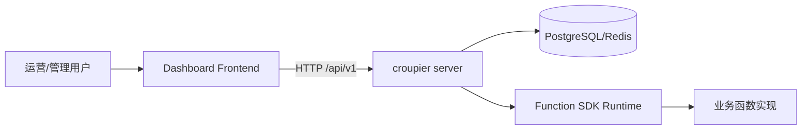
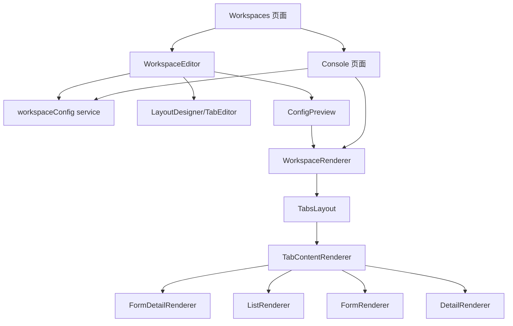
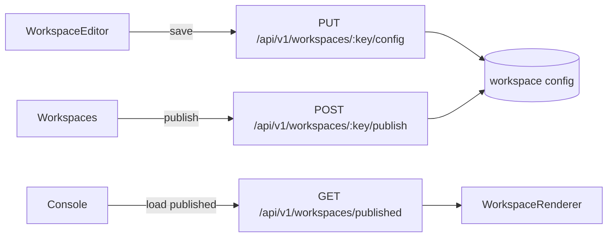
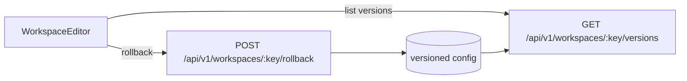

# Croupier Dashboard

<p align="left">
  
  
  
</p>

`croupier-dashboard` 是 Croupier 的前端管理台，定位为配置驱动的对象工作台系统。

当前主线能力：

- 工作台配置与发布
- 控制台运行时渲染
- 权限控制与版本回滚入口
- V1 稳定布局（`tabs + form-detail/list/form/detail`）

## 0. 图标与状态图例

- `✅` 已稳定可用（默认开启，主链路覆盖）
- `🧪` 实验/增强能力（可用，但仍在持续优化）
- `⚠️` 受限能力（仅部分场景可用，需注意边界）
- `❌` 暂不支持（当前版本不建议使用）

能力状态速览：

| 能力                                               | 状态 | 说明                           |
| -------------------------------------------------- | ---- | ------------------------------ |
| Workspace 配置保存/发布/回滚                       | ✅   | 主链路能力，已接入权限和版本   |
| tabs 顶层布局                                      | ✅   | 控制台与编辑器主入口           |
| form-detail/list/form/detail                       | ✅   | 核心布局闭环                   |
| kanban/timeline/split/wizard/dashboard/grid/custom | 🧪   | 已支持编辑和预览，持续增强中   |
| 函数界面向导（单函数）                             | 🧪   | 基于 descriptor 可视化生成布局 |
| 多函数编排向导                                     | 🧪   | 自动角色分配 + 手动改绑        |
| 节点执行语义（Node Graph runtime）                 | ❌   | 不在当前稳定交付范围           |

## 1. 快速开始

### 1.1 依赖要求

- Node.js `>=22.0.0`
- pnpm `>=9`

### 1.2 安装与启动

```bash
pnpm install
pnpm dev
```

默认访问：`http://localhost:8000`

### 1.3 常用命令

```bash
pnpm dev
pnpm build
pnpm test
pnpm lint
pnpm tsc
```

## 2. 当前功能边界（稳定 + 增强）

稳定主链路（默认建议）：

- 顶层布局：`tabs`
- Tab 布局：`form-detail`、`list`、`form`、`detail`

增强能力（已可用，持续优化）：

- `wizard` / `dashboard` / `grid` / `kanban` / `timeline` / `split` / `custom`
- 函数界面向导（单函数）
- 多函数编排向导（自动分配 + 手动改绑）

当前不支持：

- 节点流程执行语义（Node Graph runtime 执行）

## 3. 架构关系图（Graph）

### 3.1 系统关系



### 3.2 前端核心模块关系



### 3.3 工作台配置流转



### 3.4 版本与回滚链路



## 4. 页面与路由

关键入口：

- 工作台管理：`/system/functions/workspaces`
- 工作台详情：`/system/functions/workspaces/:objectKey`
- 工作台编辑：`/system/functions/workspace-editor/:objectKey`
- 控制台首页：`/console`
- 控制台工作台：`/console/:objectKey`

路由定义文件：

- `config/routes.ts`

## 5. 目录结构

```text
src/
  components/
    WorkspaceRenderer/
      index.tsx
      TabsLayout.tsx
      TabContentRenderer.tsx
      renderers/
  pages/
    Workspaces/
    WorkspaceEditor/
    Console/
  services/
    workspaceConfig.ts
    api/workspace.ts   # 兼容层（deprecated）
    workspace/telemetry.ts
  types/
    workspace.ts
```

## 6. Workspace 数据模型（简化）

```ts
type WorkspaceStatus = 'draft' | 'published' | 'archived';

interface WorkspaceConfig {
  objectKey: string;
  title: string;
  description?: string;
  layout: WorkspaceLayout;
  published?: boolean;
  status?: WorkspaceStatus;
  version?: number;
  publishedAt?: string;
  publishedBy?: string;
  menuOrder?: number;
  meta?: WorkspaceMeta;
}
```

## 7. API 约定（前端使用）

工作台配置：

- `GET /api/v1/workspaces/:objectKey/config`
- `PUT /api/v1/workspaces/:objectKey/config`
- `GET /api/v1/workspaces/configs`
- `DELETE /api/v1/workspaces/:objectKey/config`

发布与运行：

- `POST /api/v1/workspaces/:objectKey/publish`
- `POST /api/v1/workspaces/:objectKey/unpublish`
- `GET /api/v1/workspaces/published`

版本能力（已接前端服务，待后端联调确认）：

- `GET /api/v1/workspaces/:objectKey/versions`
- `POST /api/v1/workspaces/:objectKey/rollback`

## 8. 权限模型（前端）

已使用的工作台权限键：

- `workspaces:read`
- `workspaces:edit`
- `workspaces:publish`
- `workspaces:rollback`
- `workspaces:delete`

聚合能力：

- `canWorkspaceManage` = 以上权限的聚合

## 9. 埋点事件（前端）

事件通过 `window.dispatchEvent(new CustomEvent('croupier:workspace'))` 发送。

核心事件：

- `workspace_load` / `workspace_load_error`
- `workspace_save` / `workspace_save_error`
- `workspace_publish` / `workspace_publish_error`
- `workspace_unpublish` / `workspace_unpublish_error`
- `workspace_versions_load` / `workspace_versions_load_error`
- `workspace_rollback` / `workspace_rollback_error`
- `workspace_template_apply` / `workspace_template_apply_error`

## 10. 开发约束

- `services/workspaceConfig.ts` 是工作台主 service，不再新增重复契约
- 新增布局必须同时完成：
  - 类型定义
  - 编辑器配置 UI
  - 保存校验
  - 运行时 renderer
  - 测试覆盖
- 未闭环能力不得直接暴露在主 UI

## 11. 与主仓库关系

- 主仓库：`https://github.com/cuihairu/croupier`
- 本仓库负责前端管理台，不负责业务函数实现

## 12. License

Apache-2.0
